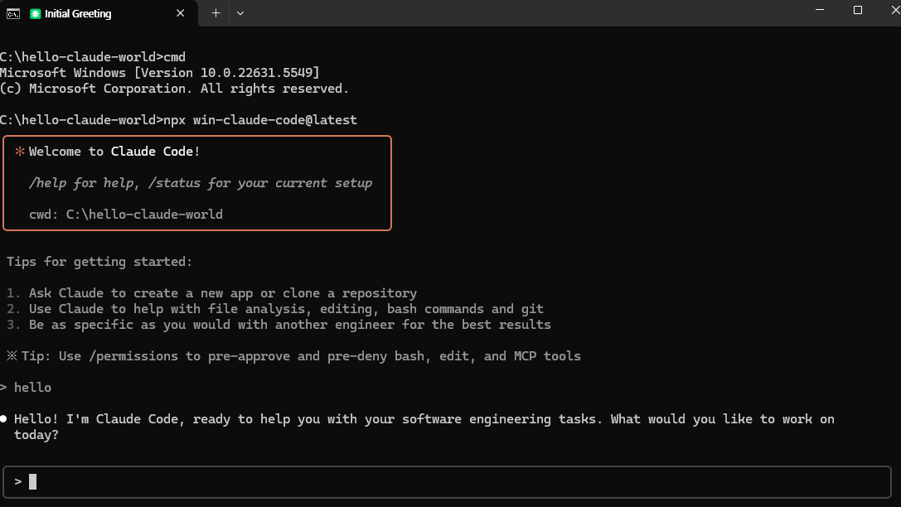

# Claude Code für Windows

> **Kein WSL. Kein Docker. Nur Windows.**

## 🌍 Sprachauswahl

[English](../../README.md) | [한국어](README.ko.md) | [中文](README.zh.md) | [日本語](README.ja.md) | [Русский](README.ru.md) | [Español](README.es.md) | [Français](README.fr.md) | [Deutsch](README.de.md)

[](https://npmjs.com/package/win-claude-code)
[](https://npmjs.com/package/win-claude-code)

Claude Code trifft auf Windows. Keine "WSL erforderlich" Fehler mehr, nur pure Produktivität.



## 🚀 Schnellstart

```bash
# Claude Code global installieren
npm install -g @anthropic-ai/claude-code --ignore-scripts

# Ausführen
npx win-claude-code@latest
```

**Das war's.** 🎉

## ✨ Funktionen

- **Umgeht bash-Abhängigkeitsprüfungen** - Keine Terminal-Erkennungsfehler mehr
- **Null Konfiguration** - Funktioniert sofort
- **Gleiche Claude-Erfahrung** - Alle Funktionen intakt
- **Unix-Befehle-Unterstützung** - Aktiviert automatisch `grep`, `find`, `awk`, `sed` und mehr mit Git Bash

## 🛠️ Unix-Befehle (optional)

Möchten Sie Unix-Befehle verwenden? Installieren Sie **Git for Windows** und win-claude-code erkennt sie automatisch:

1. Laden Sie von [git-scm.com/download/win](https://git-scm.com/download/win) herunter
2. Installieren Sie mit Standardoptionen
3. Führen Sie `npx win-claude-code` aus - Unix-Tools sind automatisch verfügbar!

Verfügbare Befehle: `grep`, `find`, `awk`, `sed`, `curl`, `wget`, `tar`, `ssh` und mehr.

## 📋 Systemanforderungen

- **Node.js** 22+
- **Windows** 10/11
- **Claude Code** (global installiert)
- **Git for Windows** (optional - für Unix-Befehle)

## 🐛 Häufige Probleme

```bash
# Claude Code nicht global installiert
"Claude Code package is not installed globally"
→ Ausführen: npm install -g @anthropic-ai/claude-code --ignore-scripts

# Unix-Befehle funktionieren nicht
"grep is not recognized as an internal or external command"
→ Git for Windows installieren: https://git-scm.com/download/win
```

Bug gefunden? [Hier melden](https://github.com/somersby10ml/win-claude-code/issues)

## 📜 Lizenz

MIT

---

**Gemacht für Entwickler, die sich weigern, WSL zu verwenden** 😎